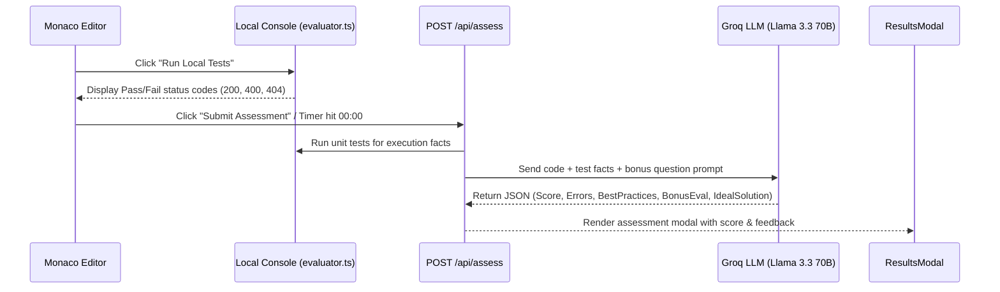

# PROJECT_STATE.md — Single Source of Truth

## 1. EXECUTIVE SUMMARY & TECH STACK

### Core Purpose & Scope
**LiveCode Logic Trainer** is a specialized, interactive web application built for live-coding technical interview preparation. It allows software engineers to practice JavaScript REST API logic under real interview time constraints (30–45 minutes). The app features a split-pane IDE, countdown timer auto-submit, real-time local test execution, and an AI-driven assessment engine powered by Groq (`llama-3.3-70b-versatile`).

### Complete Tech Stack & Key Configurations
- **Framework**: Next.js 16 (App Router, Turbopack, React 19).
- **Styling**: Tailwind CSS v4 (`@import "tailwindcss"` in `globals.css`), `clsx`, `tailwind-merge`, `lucide-react` icons.
- **Code Editor**: `@monaco-editor/react` (VS Dark theme, JS syntax highlighting, formatting, read-only mode).
- **Markdown Rendering**: `react-markdown` with GFM support.
- **AI Assessment Engine**: `groq-sdk` calling model `llama-3.3-70b-versatile` with `response_format: { type: "json_object" }`.
- **Database / Storage**: **NONE (Strictly In-Memory)**. Seed data and session states use JavaScript objects/arrays.
- **Visual FX**: `canvas-confetti` on successful assessment pass.
- **Environment Config**: `GROQ_API_KEY` defined in `.env.local` (ignored by git).

---

## 2. PROJECT STRUCTURE & ARCHITECTURE

### Directory Tree & Responsibilities
```
livecode-logic-trainer/
├── app/                            # Next.js App Router root
│   ├── page.tsx                    # Landing page, problem list, role filter
│   ├── layout.tsx                  # Root HTML layout & font configuration
│   ├── globals.css                 # Tailwind CSS v4 directives & custom scrollbars
│   ├── session/[problemId]/
│   │   └── page.tsx                # Interactive split-pane live coding session
│   └── api/
│       └── assess/
│           └── route.ts            # POST /api/assess (Groq LLM + local evaluator route)
├── components/                     # Modular UI Components
│   ├── SessionHeader.tsx           # Session navigation bar, title, timer, action buttons
│   ├── TimerBar.tsx                # Countdown timer, status colors, auto-submit trigger
│   ├── ProblemPanel.tsx            # Left panel: Markdown description, bonus question, rubric
│   ├── EditorPanel.tsx             # Right panel: Monaco Editor wrapper with format/reset
│   ├── ConsolePanel.tsx            # Bottom drawer: Local unit test runner & execution logs
│   └── ResultsModal.tsx            # Assessment modal: Score, errors, best practices, ideal code
├── lib/                            # Core Logic & Utilities
│   ├── types.ts                    # TypeScript interfaces (Problem, AssessmentResult, TestRunResult)
│   ├── problems.ts                 # In-memory problem seed definitions
│   └── evaluator.ts                # Isolated JS function sandbox & test execution runner
├── .env.local                      # Secret keys (GROQ_API_KEY - Git Ignored)
├── .env.local.example              # Key template for development
├── README.md                       # Developer documentation & quickstart
└── PROJECT_STATE.md                # Single Source of Truth for AI Agents
```

### Architectural Patterns Applied
- **Next.js App Router Component Hierarchy**: Server components for route layout; `'use client'` explicitly declared on interactive client widgets (`EditorPanel`, `TimerBar`, `ResultsModal`).
- **Split-Pane IDE Pattern**: 40/60 horizontal split layout with responsive flex columns and fixed vertical heights.
- **Dual-Engine Evaluation Strategy**:
  1. *Primary Engine*: Groq API (`llama-3.3-70b-versatile`) producing strict structured JSON evaluations.
  2. *Fallback / Auxiliary Engine*: `lib/evaluator.ts` running mocked Express `req`/`res` contexts via JavaScript `Function` constructor execution for zero-latency local feedback.
- **Data Encapsulation**: Complete isolation of seed problems in `lib/problems.ts` avoiding database overhead.

---

## 3. CURRENT IMPLEMENTATION STATE & DATA FLOW

### Built Modules & Active Features
1. **Landing / Problem Discovery (`app/page.tsx`)**: Filterable problem list by role (Backend, Frontend, Full Stack, QA) and level.
2. **Interactive Live Session (`app/session/[problemId]/page.tsx`)**:
   - Synchronized 45-minute countdown timer with low-time visual warnings.
   - Live Monaco code editor supporting standard JS / Express syntax.
   - Dynamic tabbed problem pane (`ProblemPanel.tsx`) with markdown rendering and PostgreSQL race condition bonus prompts.
3. **Local Test Runner (`components/ConsolePanel.tsx` & `lib/evaluator.ts`)**: Runs mock payload requests (`userId`, `voucherCode`) against candidate code to test status codes (`200`, `400`, `404`) in real time.
4. **AI Assessment Route (`app/api/assess/route.ts`)**: Receives `{ problemId, userCode, timeSpent }`, executes local unit tests, feeds results + code to Groq LLM, and returns structured `AssessmentResult`.
5. **Results Presentation (`components/ResultsModal.tsx`)**: Detailed feedback popup with score badge, celebratory confetti on PASS, error breakdowns, engineering best practice recommendations, bonus question analysis, and ideal solution viewer.

### Critical Data Flow


---

## 4. REMAINING TASKS, TODOs & TECHNICAL DEBT

### Pending Enhancements & Future Features
- **Multi-File Problem Support**: Extend `EditorPanel` to support multiple tabs (e.g., `routes.js`, `controllers.js`, `models.js`).
- **Additional Seed Problems**: Add seed problems for Frontend Engineer (React state logic), QA Engineer (API test suite writing), and Full Stack roles.
- **Custom Timer Settings**: Allow candidates to choose custom time limits (15, 30, 45, 60 minutes) prior to starting a session.

### Known Technical Debt & Edge Cases
- `lib/evaluator.ts` uses JavaScript `Function` constructor with mock `express` stubs for local testing. While fast, complex third-party NPM modules beyond Express are not mocked in local execution.
- Monaco Editor loading requires dynamic client-side rendering (handled via `'use client'` component boundaries).

---

## 5. AI AGENT CODING GUIDELINES

### Naming & Placement Conventions
- **Components**: PascalCase in `components/` (e.g., `ProblemPanel.tsx`, `ResultsModal.tsx`). Always add `'use client';` directive if hooks or DOM references are used.
- **API Routes**: App Router syntax in `app/api/<route-name>/route.ts`. Use standard `NextRequest` and `NextResponse`.
- **Logic & Types**: Exported type definitions strictly placed in `lib/types.ts`. Seed data in `lib/problems.ts`.
- **Environment Keys**: NEVER hardcode API keys or secret strings in code files. Always read from `process.env.GROQ_API_KEY` and reference in `.env.local.example`.

### Workflow for Implementing New Features / Problems
1. **Define Types**: Update `lib/types.ts` if adding new data properties.
2. **Add Seed Problem**: Append new problem object to `PROBLEMS` array in `lib/problems.ts`.
3. **Update Evaluator**: Add specialized assertion functions in `lib/evaluator.ts` if new endpoint routes are introduced.
4. **Build Component / UI**: Add modular UI components in `components/` using Tailwind CSS v4 utility classes.
5. **Verify Build**: Run `npm run build` to verify zero TypeScript or Turbopack errors.
6. **Git Commit**: Commit logical increments in English with descriptive message prefixes (`feat:`, `fix:`, `docs:`).
